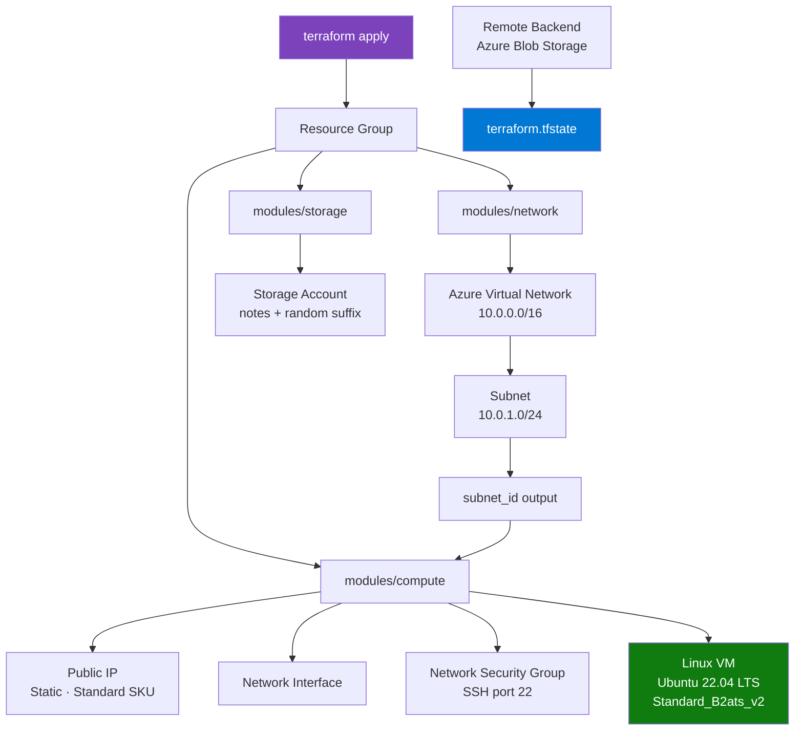

# Azure Infrastructure — Terraform Modules


> A modular **Terraform** project that provisions a complete Azure cloud infrastructure — Virtual Network, Linux VM, and Storage Account — using reusable modules, remote state backend, and production-grade secret management.

---

## 📋 Table of Contents

- [Overview](#-overview)
- [Architecture](#-architecture)
- [Infrastructure Diagram](#-infrastructure-diagram)
- [Tech Stack](#️-tech-stack)
- [Project Structure](#-project-structure)
- [Resources Provisioned](#-resources-provisioned)
- [Getting Started](#-getting-started)
- [Running Locally](#️-running-locally)
- [Secret Management](#-secret-management)
- [Environment Support](#-environment-support)
- [Outputs](#-outputs)
- [What I Learned](#-what-i-learned)
- [Author](#-author)

---

## 🌟 Overview

This project demonstrates a production-style Infrastructure as Code (IaC) workflow using Terraform on Azure. Rather than clicking through the Azure portal, every resource is defined in code, versioned in Git, and deployable with a single command.

The infrastructure is split into three independent, reusable modules — **network**, **compute**, and **storage** — each with their own inputs and outputs. State is stored remotely in Azure Blob Storage so the infrastructure can be managed safely across machines and team members.

---

## 🏗️ Architecture

```
┌─────────────────────────────────────────────────────────────────┐
│                        Root Module                              │
│                        main.tf                                  │
└────────────┬─────────────────┬───────────────────────┬──────────┘
             │                 │                       │
             ▼                 ▼                       ▼
┌────────────────┐  ┌─────────────────────┐  ┌────────────────────┐
│ modules/       │  │ modules/            │  │ modules/           │
│ network        │  │ compute             │  │ storage            │
│                │  │                     │  │                    │
│ • VNet         │  │ • Linux VM          │  │ • Storage Account  │
│ • Subnet       │  │ • NIC               │  │   (random suffix)  │
│                │  │ • Public IP         │  │                    │
│ out: subnet_id │  │ • NSG               │  │ out: account_name  │
└────────┬───────┘  │                     │  │      account_id    │
         │          │ out: public_ip      │  │      blob_endpoint │
         │ subnet_id└─────────────────────┘  └────────────────────┘
         └──────────────────▲
                            │
                     passed into compute
                     module at root level
```

---

## 🔄 Infrastructure Diagram



---

## 🛠️ Tech Stack

| Technology | Version | Purpose |
|---|---|---|
| Terraform | >= 1.3 | Infrastructure as Code |
| AzureRM Provider | ~> 3.0 | Azure resource management |
| Random Provider | ~> 3.0 | Unique storage account naming |
| Azure Linux VM | Ubuntu 22.04 LTS | Compute resource |
| Azure Blob Storage | — | Remote Terraform state backend |
| Azure Container Registry | — | Private networking layer |

---

## 📁 Project Structure

```
azure-terraform/
├── main.tf                        # Root module — wires all modules together
├── variables.tf                   # Root input variable declarations
├── outputs.tf                     # Root outputs (VM public IP)
├── provider.tf                    # AzureRM + Random provider configuration
├── backend.tf                     # Remote state backend (Azure Blob Storage)
├── terraform.tfvars.example       # Safe-to-commit variable template
├── environments/
│   └── dev.tfvars                 # Dev environment variable values
└── modules/
    ├── network/
    │   ├── main.tf                # VNet and Subnet resources
    │   ├── variables.tf           # Network input variables
    │   └── outputs.tf             # Exports subnet_id
    ├── compute/
    │   ├── main.tf                # VM, NIC, Public IP, NSG resources
    │   ├── variables.tf           # Compute input variables
    │   └── outputs.tf             # Exports public_ip
    └── storage/
        ├── main.tf                # Storage account + random suffix
        ├── variables.tf           # Storage input variables
        └── outputs.tf             # Exports account name, ID, blob endpoint
```

---

## 📦 Resources Provisioned

| Resource | Name | Description |
|---|---|---|
| `azurerm_resource_group` | `notes-app-rg` | Container for all resources |
| `azurerm_virtual_network` | `notes-vnet` | VNet with address space `10.0.0.0/16` |
| `azurerm_subnet` | `notes-subnet` | Subnet `10.0.1.0/24` inside the VNet |
| `azurerm_public_ip` | `notes-public-ip` | Static Standard SKU public IP |
| `azurerm_network_interface` | `notes-nic` | NIC attached to subnet and public IP |
| `azurerm_network_security_group` | `notes-nsg` | NSG with inbound SSH rule on port 22 |
| `azurerm_linux_virtual_machine` | `notes-vm` | Ubuntu 22.04 LTS · `Standard_B2ats_v2` |
| `azurerm_storage_account` | `notes<suffix>` | Standard LRS with random 5-char suffix |

---

## 🚀 Getting Started

### Prerequisites

- Active **Azure subscription**
- **Terraform** >= 1.3 installed ([install guide](https://developer.hashicorp.com/terraform/install))
- **Azure CLI** installed and logged in (`az login`)

### Step 1 — Clone the repository

```bash
git clone https://github.com/Nev-007/azure-terraform.git
cd azure-terraform
```

### Step 2 — Set up your variable file

```bash
cp terraform.tfvars.example terraform.tfvars
```

Edit `terraform.tfvars` with your values. This file is git-ignored and must never be committed.

### Step 3 — Supply the VM password securely

The VM admin password is never stored in any file. Pass it via environment variable at runtime:

```bash
export TF_VAR_vm_admin_password="YourSecurePassword"
```

### Step 4 — Bootstrap the remote backend

The backend storage account must exist before `terraform init`. Run this once:

```bash
az group create \
  --name terraform-state-rg \
  --location centralindia

az storage account create \
  --name tfstatestorage98765092 \
  --resource-group terraform-state-rg \
  --location centralindia \
  --sku Standard_LRS

az storage container create \
--name tfstate \
--account-name tfstatestorage98765092
```

### Step 5 — Initialize and deploy

```bash
# Initialise providers and backend
terraform init

# Preview what will be created
terraform plan -var-file=terraform.tfvars

# Deploy the infrastructure
terraform apply -var-file=terraform.tfvars
```

---

## 🖥️ Running Locally

**Deploy with the dev environment config:**

```bash
export TF_VAR_vm_admin_password="YourSecurePassword"
terraform apply -var-file=environments/dev.tfvars
```

**SSH into the VM after deployment:**

```bash
ssh azureuser@$(terraform output -raw vm_public_ip)
```

**Tear down all resources:**

```bash
terraform destroy -var-file=terraform.tfvars
```

---

## 🔐 Secret Management

This project follows these practices to keep credentials out of version control:

| Practice | Implementation |
|---|---|
| Password never in files | `vm_admin_password` supplied via `TF_VAR_vm_admin_password` env var only |
| Masked in Terraform output | `sensitive = true` on all password variables |
| `terraform.tfvars` git-ignored | Real values never leave the local machine |
| Safe example committed | `terraform.tfvars.example` with placeholder values is committed instead |

---

## 🌍 Environment Support

The `environments/` folder supports deploying the same infrastructure to different environments using separate variable files:

```bash
# Deploy to dev
terraform apply -var-file=environments/dev.tfvars

# Deploy to prod (add environments/prod.tfvars)
terraform apply -var-file=environments/prod.tfvars
```

---

## 📤 Outputs

| Output | Description |
|---|---|
| `vm_public_ip` | Public IP address of the provisioned Linux VM |
| `storage_account_name` | Name of the created storage account |
| `storage_account_id` | Azure resource ID of the storage account |
| `primary_blob_endpoint` | Blob service endpoint URL |

---

## 📖 What I Learned

- **Modular Terraform design** — splitting infrastructure into network, compute, and storage modules with clean input/output contracts between them
- **Remote state management** — storing `terraform.tfstate` in Azure Blob Storage so state is never lost and can be shared across environments
- **Secret handling in IaC** — using `sensitive = true`, environment variables, and `.gitignore` to ensure credentials never appear in code or terminal output
- **Provider version pinning** — locking `azurerm ~> 3.0` and `random ~> 3.0` to prevent unexpected breaking changes from provider upgrades
- **Environment separation** — using separate `.tfvars` files per environment to deploy the same module code to dev and prod without duplication

---

> Built with ❤️ by [Nev](https://github.com/Nev-007)
